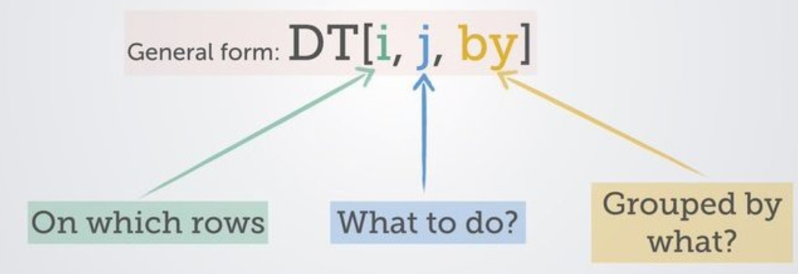

```{r setup, include=FALSE}
knitr::opts_chunk$set(echo = TRUE)
```


## Data.Table - everything you need to know to get you started in R

I will take you through step by step how to use the data.table package, and compare it with base R operations, to see the performance gains you get when using this optimised package. 

## Load in data.table
To load the package in you can follow the below instructions:
```{r install_packs}
#install.packages(data.table)
library(data.table)

```

### Reading in a data.table csv

To read files in data.table you use the <strong>fread</strong> syntax to bring files in. I will load the NHSRDatasets package and export this out and then I will use the data.table functionality to read it back in:

```{r importdata}
library(NHSRdatasets)
ae <- NHSRdatasets::ae_attendances
write.csv(ae, "ae_nhsr.csv", row.names = FALSE) #Set row names to false
#Use data.table to read in the document
ae_dt <- fread("ae_nhsr.csv")

```

## Benchmarking the speed of data.table vs base R

Here, we will create a synthetic frame, using a random number generator, to show how quick the data.table package is compared to base R:

```{r bench}
#Create a random uniform distribution
big_data <- data.frame(BigNumbers=runif(matrix(10000000, 10000000)))
write.csv(big_data, "bigdata.csv")
```

Start the benchmarking:

```{r benchmark}
# Start to benchmark using system.time
# Read CSV with base
base_metrics <- system.time(
  read.csv("bigdata.csv")
)

dt_metrics <- system.time(
  data.table::fread("bigdata.csv")
)
print(base_metrics)
print(dt_metrics)

# # user  system elapsed 
#   25.78    0.42   26.74 
#    user  system elapsed 
#    1.09    0.07    0.33 

```

Compare on a ggplot side by side:

```{r comparison}
library(dplyr)
library(tibble)
library(ggplot2)


df <- data.frame(
  base_run_time = base_metrics[1], #Grab the elapsed time for the user
  data.table_run_time = dt_metrics[1] #Grab the elapsed time for the user
)
#Flip data.frame over to get the run times using transpose
df<- data.frame(t(df)) %>% 
  rownames_to_column() %>% 
  setNames(c("Type", "TimeRan"))

# Make the ggplot
library(ggplot2)

plot <- df %>% 
  ggplot(aes(x=Type, 
             y=TimeRan, 
             fill=as.factor(Type))) + geom_bar(stat="identity", 
                                               width = 0.6) +
         scale_fill_manual(values= c("#26ACB5", "#FAE920")) + theme_minimal() +
         theme(legend.position = "none") + coord_flip() +
         labs(title="Run time comparison data.table and ggpplot", 
              y="Run Time (seconds)", 
              x="Data.Table vs Base",
              caption="Produced by Gary Hutson") 

print(plot)
```
As you can see - data.table is lightening fast compared to base R and it is great for working with large datasets.

We detract, this section is just to highlight how useful the data.table package is for dealing with larger datasets. 

## Conversion between data.table and data.frame (base) objects

Time to time you may want to convert the data.table objects back to base R, to do this you can follow the below:

```{r conversion}
#Convert base data.frame to data.table
ae_dt <- as.data.table(ae)
class(ae_dt)

#Using the setDT command
ae_copy <- ae
data.table::setDT(ae_copy)
class(ae_copy)

# Converting this back to a data.frame
data.table::setDF(ae_copy)
class(ae_copy)
# [1] "data.table" "data.frame"
# [1] "data.table" "data.frame"
# [1] "data.frame"

```

To expand on the above:

- I set the original A and E data, from the loading example, using the as.data.table command, this coerced the data.frame into a data.table object. We inspect that this has been changed by checking the class of the object
- I then made a copy of the data.frame and used the <strong>setDT()</strong> syntax to set it to a data.table object. Again, I then used class to check the class of the object
- Finally, I used the setDF to force it back to a data.frame, as this object had been converted to a data.table object in the previous step. I used class to check the type and this has successfully been changed back.

## Filtering on a data.table object

The general rule to filtering is to use the below visual:


     
We will used our accident and emergency dataset (ae_dt) to work with some of the fields and commence filtering:

```{r filtering_dt}
# Filter out hospital types and high attendances
ae_reduced <- ae_dt[type == 1 & attendances > 30000 & org_code != "R1H", ] #The comma indicates rows and no columns
print(ae_reduced)

```
This selects my arrival type equal to 1, filters out accident and emergency attendances greater than (>) 30000 and organisation code is not equal (1=) to R1H, which relates to a specific NHS trust. The ampersand means filter on this field and(&) that field. 

## Indexing and selecting data.table objects

This will show you how to perform selections on columns:

### Selecting given columns

The code snippet shows how to select only given columns, as an index:

```{r select_give}
#Select by index
ae_dt[,1] #Select the first column
ae_dt[,c(1,3)] #Select the first and third column
ae_dt[, 1:4] #Select a range of the first 1 to 4 columns
#Select by column name
head(ae_dt[, period]) #Select by name
#[1] "2017-03-01" "2017-03-01" "2017-03-01" "2017-03-01" "2017-03-01" "2017-03-01"

```

## Selecting multiple columns using a character vector

By character vector, I mean a list of columns to select from the data.frame:

```{r select_mult}
# One column
my_col <- "period"
ae_dt[, my_col, with=FALSE]

#Multiple columns
#First way
ae_dt[, list(period, attendances)]
#My preferred way
ae_dt[, .(period, attendances)]

```
The first way means you have to specify a list wrapper, otherwise you can use the special period operator to do this.

## Dropping columns

To drop columns in data.table you can use the below commands:

```{r drop_tutorial}
ae_dt_copy <- ae_dt
drop_cols <- c("period", "breaches")
ae_drops <- ae_dt_copy[, !drop_cols, with=FALSE]
# This says keep the columns that are not equal to ! my list of drop cols
names(ae_drops)

```
## Renaming columns
To rename columns, use this convention below:
```{r column_renaming}
# Rename a single column
setnames(ae_dt_copy, "period", "month", skip_absent = TRUE)
colnames(ae_dt_copy)

```

Viola, there you go, renamed from old to new. 

## Column creation from existing columns like mutate

To create a new column in base you use the dollar sign, to do it in dplyr you use mutate and in data.table you use the below conventions:

```{r creation_new_cols}
new_col <- ae_dt_copy[, ed_performance := 1-(breaches/attendances)]
glimpse(new_col)
```

To create multiple columns, we use the below syntax - the special column command needs to be wrapped in backticks:

```{r creating_mult_cols}
mult_cols <- ae_dt_copy[, `:=` (ed_performance_inv = breaches/attendances,
                   admit_to_attend_ratio = admissions/attendances)]

glimpse(mult_cols)

```

## Grouping - GroupBy 

Suppose I want to create a summary frame, similar to group_by() and summarise() in dplyr. This can be achieved in data.table, like below:

```{r group_by_dt}
summary_frame <- ae_dt_copy[, .(mean_attendance=mean(attendances),
               mean_breaches=mean(breaches), 
               sum_attendances=sum(attendances)),
           by=.(org_code)]

glimpse(summary_frame)

```

## Chaining in data.table - similar to magrittr's piping

Chaining in data.table can be achieved by the following:

```{r chaining}
chained <- ae_dt_copy[, .(mean_attendance=mean(attendances),
               mean_breaches=mean(breaches), 
               sum_attendances=sum(attendances)),
           by=.(org_code)][order(org_code)]
# Adding square brackets, instead of %>%, chains the ordering
# Here we create a group by and summarise function and at the end we add another
# Command sequence i.e. group by org code, summarise the mean and then order by ord code

glimpse(chained)
#Show ordering by org_code:


```
That is how simple it is - just add another set of square brackets after your summary function. 

## What is .SD and why should I care

Let’s suppose, you want to compute the mean of all the variables, grouped by ‘org_code’. How to do that?

You can create the columns one by one by writing by hand. Or, you can use the lapply() function to do it all in one go. But `lapply()` takes the data.frame as the first argument. Then, how to use `lapply() inside a data.table?

```{r sd_arg}
ae_summarised <- ae_dt_copy[, lapply(.SD[, 4:6, with=F], mean), by=org_code]
# .SD allows for it to be used in an lapply statement to create the column mean group by org_code 
# of multiple columns
glimpse(ae_summarised)

```
Instead of me slicing the breaches to ed_performance column - I could add <strong>.SDcols</strong> to specify the exact columns to use in the function:

```{r sd_cols}
sd_cols_agg <- ae_dt_copy[, lapply(.SD, mean), by=org_code,
           .SDcols=c("breaches", "admissions")]

# Take the mean, group by organisation code and use SDCols breaches and admissions to performs aggregations on
glimpse(sd_cols_agg)

```

It takes some getting used to for tidyverse users, but the performance benefits are massive.

## Setting Keys - to speed up searches

Setting one or more keys on a data.table enables it to perform binary search, which is many order of magnitudes faster than linear search, especially for large data. To set keys, follow the routine below:

```{r set_keys}
setkey(ae_dt_copy, org_code)
# Check the key has been assigned
key(ae_dt_copy) #Prints out org_code as the key


```

Merging data.tables together now becomes a breeze, and will speed up and even quicker process:

```{r data.table_merger}

dt1 <- ae_dt_copy[, .(org_code, breaches, admissions)]
dt2 <- ae_dt_copy[1:10, .(org_code, type)]

# Join the tables
merged <- dt1[dt2]
glimpse(merged)

```
### Removing keys

To remove the key on the data.table we use this logic:

```{r removal_of_key}
setkey(ae_dt_copy, NULL)
key(ae_dt_copy)

```

The key has now been removed. 

## Joining tables

Next, I show how data.table handles joining tables. First, I will set up the data.table:

```{r setup_dt}

dt1 <- ae_summarised
dt2 <- ae_summarised[1:10, .(org_code, new_admits=admissions)]

```

### Inner Join

To join the matching rows, we will use an inner join:

```{r inner_join}
inner_joined_df <- merge(dt1, dt2, by="org_code")
glimpse(inner_joined_df)

```

### Left Join

Using the left join:

```{r left_join}
left_joined <- merge(dt1, dt2, by="org_code", all.x = TRUE, allow.cartesian = FALSE)
glimpse(left_joined)

```

### Outer Join

The outer join can be performed like so:

```{r outer_join}
outer_join <- merge(dt1, dt2, by="org_code", all=TRUE)
glimpse(outer_join)

```

That concludes the section on joins. The next section looks at the Pivot Table functionality in data.table.


## Pivoting using data.table

This example uses the copy data frame we made and uses the organisation code by the type of attendances. I want to then summarise the mean admissions by type and organisation code. To achieve this:

```{r pivots}
dcast.data.table(ae_dt_copy, org_code ~ type, fun.aggregate = mean, value.var = 'admissions')

```

## Conclusion 

That concludes the tour into data.table. This is a really flexible package and can be used for a variety of purposes. For Base R users the transition will be easier, as some of the subsetting concepts are not taught if you approach it from a tidy perspective, but this can lead to massive performance gains in your code. Perhaps to even match Python?
